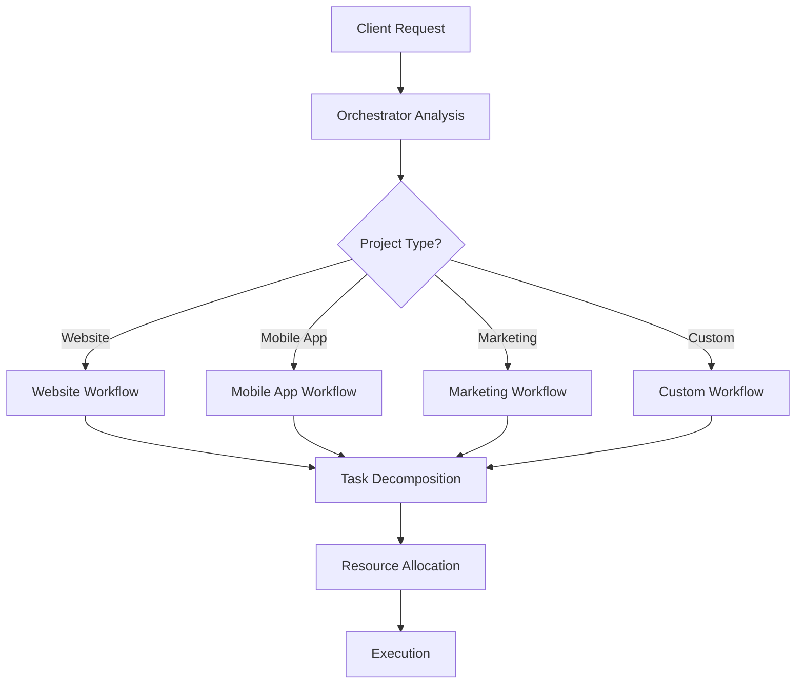

# AI Agency - Техническое задание
## Версия 1.0 - Полная реализация

## 1. Общее описание

### 1.1 Концепция
**AI Agency** - это автоматизированное цифровое агентство на базе Claude API, где специализированные AI-агенты работают как единая команда над проектами любой сложности.

### 1.2 Ключевые преимущества
- **Масштабируемость**: От простых задач до комплексных проектов
- **Параллельная работа**: Агенты работают одновременно над разными частями
- **Специализация**: Каждый агент - эксперт в своей области
- **Контроль качества**: Многоуровневая проверка результатов
- **Адаптивность**: Система учится на каждом проекте

### 1.3 Целевая аудитория
- Стартапы (MVP, прототипы)
- SMB компании (маркетинг, разработка)
- Enterprise (комплексные проекты)
- Фрилансеры (усиление возможностей)

## 2. Архитектура системы

### 2.1 Общая структура

```
┌─────────────────────────────────────────────┐
│              CLIENT INTERFACE               │
│         (Web UI / API / Telegram)           │
└─────────────┬───────────────────────────────┘
              │
┌─────────────▼───────────────────────────────┐
│            ORCHESTRATOR AGENT               │
│         (CEO / Product Manager)             │
└─────────────┬───────────────────────────────┘
              │
┌─────────────▼───────────────────────────────┐
│           TASK DECOMPOSER                   │
│     (Анализ и декомпозиция задач)          │
└─────────────┬───────────────────────────────┘
              │
┌─────────────▼───────────────────────────────┐
│          AGENT POOL MANAGER                 │
│    ┌──────────┬──────────┬──────────┐     │
│    │Marketing │Developer │ Analyst  │      │
│    ├──────────┼──────────┼──────────┤     │
│    │   UX     │    PM    │    QA    │      │
│    ├──────────┼──────────┼──────────┤     │
│    │ Content  │  DevOps  │ Designer │      │
│    └──────────┴──────────┴──────────┘     │
└─────────────┬───────────────────────────────┘
              │
┌─────────────▼───────────────────────────────┐
│         SHARED KNOWLEDGE BASE               │
│    (PostgreSQL + Vector DB + Redis)         │
└─────────────────────────────────────────────┘
```

### 2.2 Компоненты системы

#### 2.2.1 Core System
- **Orchestrator Service**: Главный координатор
- **Task Queue**: Очередь задач (Celery + Redis)
- **Agent Manager**: Управление жизненным циклом агентов
- **Communication Bus**: Межагентная коммуникация
- **Knowledge Base**: Централизованное хранилище знаний

#### 2.2.2 Agent System
- **Agent Factory**: Создание и конфигурация агентов
- **Prompt Manager**: Управление system prompts
- **Context Manager**: Управление контекстом для каждого агента
- **Performance Monitor**: Отслеживание эффективности агентов

#### 2.2.3 Storage System
- **PostgreSQL**: Основная БД (проекты, задачи, результаты)
- **Vector DB (Pinecone/Weaviate)**: Семантический поиск
- **Redis**: Кэш и очереди
- **S3/MinIO**: Хранение артефактов

## 3. Агенты системы

### 3.1 Orchestrator Agent (Главный координатор)

**Роль**: CEO/Product Manager виртуального агентства

**Ответственности**:
- Прием и анализ входящих запросов
- Декомпозиция проектов на задачи
- Распределение задач между агентами
- Контроль выполнения и дедлайнов
- Интеграция результатов
- Коммуникация с клиентом

**Ключевые навыки**:
- Project decomposition
- Resource allocation
- Risk assessment
- Quality control
- Strategic planning

**Промпт структура**:
```python
{
    "role": "CEO of AI Agency",
    "expertise": ["project management", "strategic planning", "team coordination"],
    "communication_style": "professional, clear, decisive",
    "decision_framework": "impact vs effort matrix",
    "quality_standards": "enterprise-grade"
}
```

### 3.2 Marketing Agent

**Роль**: Chief Marketing Officer

**Ответственности**:
- Маркетинговые стратегии
- Анализ целевой аудитории
- Контент-планы
- SEO/SEM рекомендации
- Конкурентный анализ
- УТП и позиционирование

**Специализации**:
- Digital Marketing
- Content Marketing
- Growth Hacking
- Brand Strategy
- Market Research

### 3.3 Developer Agents

#### 3.3.1 Frontend Developer
**Технологии**: React, Vue, Angular, Next.js
**Задачи**: UI компоненты, интеграция API, оптимизация

#### 3.3.2 Backend Developer  
**Технологии**: Python, Node.js, Go, PostgreSQL
**Задачи**: API design, бизнес-логика, базы данных

#### 3.3.3 Mobile Developer
**Технологии**: React Native, Flutter, Swift, Kotlin
**Задачи**: iOS/Android приложения

#### 3.3.4 DevOps Engineer
**Технологии**: Docker, K8s, CI/CD, AWS/GCP
**Задачи**: Инфраструктура, деплой, мониторинг

### 3.4 Analyst Agent

**Роль**: Data Analyst / Business Analyst

**Ответственности**:
- Анализ данных и метрик
- Построение дашбордов
- A/B тестирование
- Предиктивная аналитика
- Business Intelligence
- Подготовка отчетов

**Инструменты знания**:
- SQL, Python (pandas, numpy)
- Tableau, PowerBI концепции
- Statistical analysis
- ML basics

### 3.5 UX/UI Designer Agent

**Роль**: Head of Design

**Ответственности**:
- User Research
- Information Architecture  
- Wireframing
- Prototyping
- Design Systems
- Usability Testing

**Deliverables**:
- User Personas
- User Journey Maps
- Wireframes (описание)
- UI Kit specifications
- Prototype descriptions

### 3.6 Project Manager Agent

**Роль**: Scrum Master / Project Manager

**Ответственности**:
- Sprint planning
- Backlog management
- Risk management
- Resource planning
- Stakeholder communication
- Progress tracking

**Методологии**:
- Agile/Scrum
- Kanban
- Waterfall (when needed)
- Hybrid approaches

### 3.7 QA Engineer Agent

**Роль**: Head of Quality Assurance

**Ответственности**:
- Test planning
- Test case design
- Automation strategy
- Bug tracking
- Performance testing
- Security testing basics

### 3.8 Content Writer Agent

**Роль**: Content Strategist

**Ответственности**:
- Blog posts
- Technical documentation
- Marketing copy
- Social media content
- Email campaigns
- Landing pages

### 3.9 Legal Advisor Agent

**Роль**: Legal Counsel

**Ответственности**:
- Terms of Service
- Privacy Policy
- GDPR compliance
- Contract review
- Intellectual property
- Risk assessment

## 4. Рабочие процессы (Workflows)

### 4.1 Project Intake Workflow



### 4.2 Task Execution Pipeline

1. **Task Receipt**
   - Agent receives task from Orchestrator
   - Loads relevant context from Knowledge Base
   - Reviews dependencies

2. **Execution**
   - Processes task according to specialty
   - Generates deliverables
   - Updates progress in real-time

3. **Quality Check**
   - Self-validation
   - Peer review (if configured)
   - Orchestrator review

4. **Delivery**
   - Updates Knowledge Base
   - Notifies dependent agents
   - Reports to Orchestrator

### 4.3 Inter-Agent Communication Protocol

```json
{
  "message_id": "uuid",
  "timestamp": "ISO-8601",
  "from_agent": "agent_id",
  "to_agent": "agent_id|broadcast",
  "message_type": "request|response|update|error",
  "priority": "critical|high|normal|low",
  "subject": "task_id",
  "content": {
    "action": "string",
    "data": {},
    "dependencies": [],
    "deadline": "ISO-8601"
  },
  "requires_response": true,
  "response_deadline": "ISO-8601"
}
```

## 5. Техническая реализация

### 5.1 Technology Stack

#### Backend
- **Framework**: FastAPI (async, high performance)
- **Task Queue**: Celery + Redis
- **Database**: PostgreSQL 15+
- **Vector DB**: Pinecone/Weaviate
- **Cache**: Redis
- **Storage**: S3/MinIO

#### Frontend  
- **Framework**: Next.js 14 (React)
- **UI Library**: Shadcn/ui + Tailwind CSS
- **State Management**: Zustand
- **API Client**: TanStack Query
- **Real-time**: WebSockets/SSE

#### Infrastructure
- **Containerization**: Docker + Docker Compose
- **Orchestration**: Kubernetes (production)
- **Monitoring**: Prometheus + Grafana
- **Logging**: ELK Stack
- **CI/CD**: GitHub Actions

### 5.2 Database Schema

```sql
-- Organizations (multi-tenancy)
CREATE TABLE organizations (
    id UUID PRIMARY KEY DEFAULT gen_random_uuid(),
    name VARCHAR(255) NOT NULL,
    plan VARCHAR(50) DEFAULT 'starter',
    credits_balance INTEGER DEFAULT 1000,
    created_at TIMESTAMP DEFAULT NOW()
);

-- Projects
CREATE TABLE projects (
    id UUID PRIMARY KEY DEFAULT gen_random_uuid(),
    organization_id UUID REFERENCES organizations(id),
    name VARCHAR(255) NOT NULL,
    description TEXT,
    status VARCHAR(50) DEFAULT 'draft',
    type VARCHAR(50), -- website, mobile_app, marketing, etc
    priority VARCHAR(20) DEFAULT 'normal',
    deadline TIMESTAMP,
    created_at TIMESTAMP DEFAULT NOW(),
    updated_at TIMESTAMP DEFAULT NOW()
);

-- Tasks
CREATE TABLE tasks (
    id UUID PRIMARY KEY DEFAULT gen_random_uuid(),
    project_id UUID REFERENCES projects(id),
    parent_task_id UUID REFERENCES tasks(id),
    assigned_agent VARCHAR(100),
    title VARCHAR(255) NOT NULL,
    description TEXT,
    status VARCHAR(50) DEFAULT 'pending',
    priority VARCHAR(20) DEFAULT 'normal',
    task_type VARCHAR(100),
    input_data JSONB,
    output_data JSONB,
    dependencies UUID[],
    estimated_tokens INTEGER,
    actual_tokens INTEGER,
    started_at TIMESTAMP,
    completed_at TIMESTAMP,
    created_at TIMESTAMP DEFAULT NOW()
);

-- Agent Executions
CREATE TABLE agent_executions (
    id UUID PRIMARY KEY DEFAULT gen_random_uuid(),
    task_id UUID REFERENCES tasks(id),
    agent_type VARCHAR(100) NOT NULL,
    prompt TEXT,
    response TEXT,
    tokens_used INTEGER,
    execution_time_ms INTEGER,
    status VARCHAR(50),
    error_message TEXT,
    metadata JSONB,
    created_at TIMESTAMP DEFAULT NOW()
);

-- Inter-Agent Messages
CREATE TABLE agent_messages (
    id UUID PRIMARY KEY DEFAULT gen_random_uuid(),
    from_agent VARCHAR(100),
    to_agent VARCHAR(100),
    task_id UUID REFERENCES tasks(id),
    message_type VARCHAR(50),
    content JSONB,
    status VARCHAR(50) DEFAULT 'pending',
    created_at TIMESTAMP DEFAULT NOW()
);

-- Knowledge Base
CREATE TABLE knowledge_entries (
    id UUID PRIMARY KEY DEFAULT gen_random_uuid(),
    organization_id UUID REFERENCES organizations(id),
    project_id UUID REFERENCES projects(id),
    category VARCHAR(100),
    key VARCHAR(255),
    value TEXT,
    metadata JSONB,
    embedding_id VARCHAR(255), -- reference to vector DB
    created_by VARCHAR(100), -- agent_id
    created_at TIMESTAMP DEFAULT NOW(),
    updated_at TIMESTAMP DEFAULT NOW()
);

-- Artifacts (generated files)
CREATE TABLE artifacts (
    id UUID PRIMARY KEY DEFAULT gen_random_uuid(),
    project_id UUID REFERENCES projects(id),
    task_id UUID REFERENCES tasks(id),
    name VARCHAR(255),
    type VARCHAR(100), -- code, document, design, etc
    content TEXT,
    file_url VARCHAR(500),
    metadata JSONB,
    created_by VARCHAR(100),
    created_at TIMESTAMP DEFAULT NOW()
);
```

### 5.3 API Endpoints

#### Projects
```
POST   /api/projects           - Create new project
GET    /api/projects           - List projects
GET    /api/projects/{id}      - Get project details
PUT    /api/projects/{id}      - Update project
DELETE /api/projects/{id}      - Delete project
POST   /api/projects/{id}/run  - Start project execution
```

#### Tasks
```
GET    /api/projects/{id}/tasks     - List project tasks
GET    /api/tasks/{id}              - Get task details
POST   /api/tasks/{id}/retry        - Retry failed task
GET    /api/tasks/{id}/logs         - Get task execution logs
```

#### Agents
```
GET    /api/agents                  - List available agents
GET    /api/agents/{type}/status    - Get agent status
POST   /api/agents/{type}/execute   - Manual agent execution
```

#### Knowledge Base
```
GET    /api/knowledge               - Search knowledge base
POST   /api/knowledge               - Add knowledge entry
PUT    /api/knowledge/{id}         - Update entry
DELETE /api/knowledge/{id}         - Delete entry
```

## 6. Ключевые фичи

### 6.1 Adaptive Project Planning

Система автоматически выбирает подход на основе анализа проекта:

**Quick Mode** (< 4 часа)
- Простые задачи
- 1-2 агента
- Минимальная документация

**Standard Mode** (1-3 дня)
- Средние проекты
- 3-5 агентов
- Базовая документация

**Enterprise Mode** (3+ дня)
- Комплексные проекты
- 5+ агентов
- Полная документация
- Review cycles

### 6.2 Quality Assurance System

**Уровни проверки**:
1. **Self-check**: Агент проверяет свой результат
2. **Peer review**: Другой агент той же специализации
3. **Cross-functional**: Агент смежной области
4. **Orchestrator review**: Финальная проверка
5. **Client approval**: Опционально

### 6.3 Learning & Optimization

**Continuous Improvement**:
- Анализ успешных проектов
- Выявление patterns
- Оптимизация промптов
- Улучшение декомпозиции

**Performance Metrics**:
- Task completion rate
- Token efficiency
- Quality scores
- Client satisfaction
- Time to delivery

### 6.4 Cost Management

**Token Optimization**:
- Промпт компрессия
- Контекст кэширование
- Результат переиспользование
- Batch processing

**Pricing Models**:
- Per-project pricing
- Subscription plans
- Credit system
- Enterprise contracts

## 7. Интеграции

### 7.1 Communication
- **Telegram Bot**: Полный доступ к функционалу
- **Slack**: Уведомления и управление
- **Email**: Отчеты и уведомления
- **Webhooks**: Custom integrations

### 7.2 Development Tools
- **GitHub**: Автоматические PR
- **GitLab**: CI/CD интеграция
- **Jira**: Синхронизация задач
- **Figma**: Design handoff

### 7.3 Analytics & Monitoring
- **Google Analytics**: Трекинг проектов
- **Mixpanel**: User behavior
- **Sentry**: Error tracking
- **DataDog**: Infrastructure monitoring

### 7.4 Payment Systems
- **Stripe**: Subscriptions
- **PayPal**: One-time payments
- **Crypto**: Web3 payments
- **Invoice**: Enterprise billing

## 8. Security & Compliance

### 8.1 Security Measures
- **API Key Management**: Secure vault (HashiCorp Vault)
- **Data Encryption**: At rest and in transit
- **Access Control**: RBAC
- **Audit Logging**: All actions logged
- **Rate Limiting**: Per user/organization

### 8.2 Compliance
- **GDPR**: Data privacy controls
- **SOC 2**: Security standards
- **ISO 27001**: Information security
- **PCI DSS**: Payment processing

## 9. Deployment Strategy

### 9.1 Development Environment
```yaml
# docker-compose.dev.yml
version: '3.8'
services:
  api:
    build: ./backend
    environment:
      - ENV=development
      - CLAUDE_API_KEY=${CLAUDE_API_KEY}
    volumes:
      - ./backend:/app
    ports:
      - "8000:8000"
  
  frontend:
    build: ./frontend
    volumes:
      - ./frontend:/app
    ports:
      - "3000:3000"
  
  postgres:
    image: postgres:15
    environment:
      - POSTGRES_DB=ai_agency
      - POSTGRES_PASSWORD=dev_password
  
  redis:
    image: redis:7-alpine
  
  celery:
    build: ./backend
    command: celery -A app.celery worker
    depends_on:
      - redis
      - postgres
```

### 9.2 Production Environment
- **Kubernetes**: For orchestration
- **AWS EKS/GCP GKE**: Managed K8s
- **Auto-scaling**: Based on load
- **Blue-Green Deployment**: Zero downtime
- **CDN**: CloudFlare for static assets

## 10. Roadmap

### Phase 1 (MVP) - Month 1-2
- [x] Core orchestrator
- [x] 5 essential agents (PM, Developer, Marketing, Analyst, QA)
- [x] Basic task queue
- [x] Simple web UI
- [x] PostgreSQL integration

### Phase 2 (Beta) - Month 3-4
- [ ] All 10 agents
- [ ] Advanced workflows
- [ ] Knowledge Base with Vector DB
- [ ] Telegram bot
- [ ] Multi-tenancy

### Phase 3 (Launch) - Month 5-6
- [ ] Production deployment
- [ ] Payment integration
- [ ] Advanced analytics
- [ ] API for external access
- [ ] Enterprise features

### Phase 4 (Scale) - Month 7+
- [ ] Custom agent creation
- [ ] Marketplace for workflows
- [ ] White-label solution
- [ ] Advanced AI features (Vision, Voice)
- [ ] International expansion

## 11. Success Metrics

### Technical Metrics
- **Uptime**: > 99.9%
- **Response Time**: < 2s for API
- **Task Success Rate**: > 95%
- **Token Efficiency**: 20% reduction per quarter

### Business Metrics
- **User Acquisition**: 100 users in first month
- **Retention**: > 80% monthly
- **Revenue**: $10K MRR by month 6
- **NPS Score**: > 50

### Quality Metrics
- **Code Quality**: > 85% test coverage
- **Documentation**: 100% API documented
- **Security**: 0 critical vulnerabilities
- **Performance**: < 100ms p95 latency
